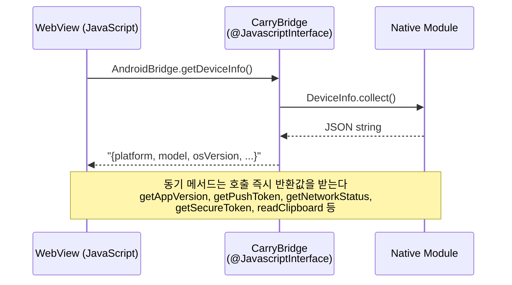
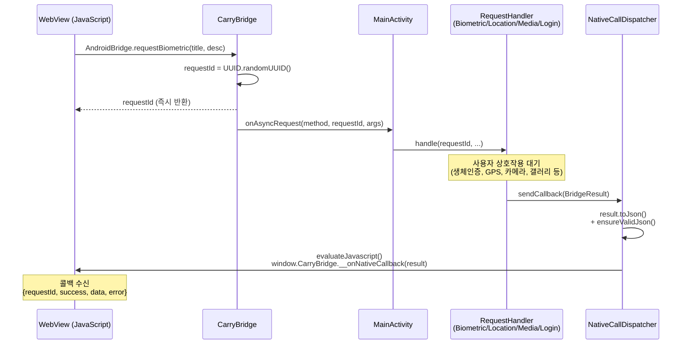
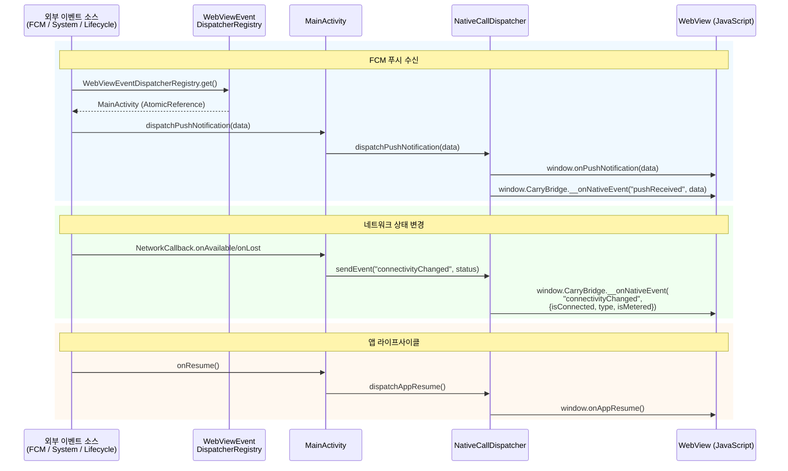

<p align="center">
  
</p>

<h1 align="center">carry-customer-android</h1>

<p align="center">
  <strong>코인 세탁 배달 O2O 서비스 고객용 Android 앱</strong>
</p>

<p align="center">
  
  
  
  
  
  
</p>

<p align="center">
  웹 앱을 네이티브 WebView로 래핑하고, JavaScript Bridge를 통해<br/>
  생체인증, 위치, 카메라, 푸시, 보안 토큰 저장, 인앱 업데이트 등 네이티브 기능을 웹에 노출합니다.
</p>

---

## 목차

- [아키텍처](#아키텍처)
- [브릿지 통신 흐름](#브릿지-통신-흐름)
- [기술 스택](#기술-스택)
- [프로젝트 구조](#프로젝트-구조)
- [JavaScript Bridge API](#javascript-bridge-api)
- [시작하기](#시작하기)
- [Product Flavors](#product-flavors)
- [딥링크](#딥링크)
- [프론트엔드 핸드오프](#프론트엔드-핸드오프)

---

## 아키텍처

```
MainActivity
├── WebView (CarryWebViewClient + CarryWebChromeClient)
├── NativeCallDispatcher       ← Native → JS 콜백/이벤트 전달
├── CarryBridge (@JavascriptInterface) ← JS → Native 호출 수신
│   └── onAsyncRequest → handleAsyncBridgeRequest() 라우팅
├── Handler 클래스들
│   ├── BiometricRequestHandler
│   ├── LocationRequestHandler
│   ├── MediaRequestHandler   ← ImageCompressor로 자동 이미지 압축
│   └── LoginRequestHandler   ← Kakao SDK 네이티브 로그인
├── PermissionHandler          ← 런타임 권한 요청 통합
├── Util 클래스들
│   ├── SecureTokenManager     ← EncryptedSharedPreferences 기반 보안 토큰
│   ├── ImageCompressor        ← 이미지 다운샘플링 + JPEG 압축
│   ├── InAppUpdateManager     ← Google Play In-App Update
│   └── NetworkUtils           ← 네트워크 상태 감지 (type, metered 포함)
├── SplashLoadingView / ErrorView
└── WebViewEventDispatcher     ← FCM 등 외부 컴포넌트 → WebView 이벤트 전달
```

### 핵심 설계 원칙

| 원칙 | 설명 |
|------|------|
| **WebView Shell** | 웹 앱을 네이티브 컨테이너로 래핑, 네이티브 기능만 브릿지로 노출 |
| **Bridge 패턴** | 동기/비동기 분리, requestId 기반 콜백으로 안전한 JS ↔ Native 통신 |
| **Permission Queue** | 런타임 권한 요청을 큐로 직렬화하여 동시 요청 충돌 방지 |
| **Event Dispatcher** | FCM 등 외부 컴포넌트가 WebView에 이벤트를 전달하는 단일 경로 |
| **Security First** | EncryptedSharedPreferences, Safe Browsing, URL 화이트리스트 |

---

## 브릿지 통신 흐름

WebView(JS)와 Native(Android) 사이의 데이터 교환은 세 가지 패턴으로 구분된다.

### 1. JS → Native (동기 호출)

JS에서 브릿지 메서드를 호출하면 Native가 즉시 값을 반환한다.



### 2. JS → Native → JS (비동기 콜백)

비동기 메서드는 `requestId`를 즉시 반환하고, 처리 완료 후 `__onNativeCallback`으로 결과를 전달한다.



### 3. Native → JS (이벤트 푸시)

네이티브에서 발생한 이벤트를 WebView로 단방향 전달한다.



---

## 기술 스택

| 분류 | 기술 |
|------|------|
| **Language** | Kotlin 2.x, JVM 11 |
| **Platform** | Android (minSdk 28, targetSdk 35) |
| **Build** | Gradle Kotlin DSL, JDK 21 |
| **WebView** | AndroidX WebKit |
| **Auth** | Kakao SDK v2, Biometric API |
| **Push** | Firebase Cloud Messaging |
| **Location** | Google Play Services Location |
| **Security** | AndroidX Security Crypto (EncryptedSharedPreferences) |
| **Update** | Google Play In-App Update API |
| **Async** | Kotlin Coroutines |

---

## 프로젝트 구조

```
app/src/main/java/com/carrylabs/carry/webviewshell/
├── MainActivity.kt                    # 메인 Activity
├── CarryApplication.kt                # Application 클래스
├── bridge/
│   ├── CarryBridge.kt                 # @JavascriptInterface (JS → Native)
│   ├── NativeCallDispatcher.kt        # Native → JS 함수 호출
│   ├── BridgeResult.kt                # 비동기 콜백 결과 DTO
│   ├── WebViewEventDispatcher.kt      # 이벤트 디스패처 인터페이스 + Registry
│   └── handlers/
│       ├── BiometricRequestHandler.kt # 생체인증
│       ├── LocationRequestHandler.kt  # GPS 위치 + Geolocation 권한
│       ├── MediaRequestHandler.kt     # 카메라 / 갤러리 / 파일 선택 + 이미지 압축
│       └── LoginRequestHandler.kt     # 카카오 SDK 네이티브 로그인
├── webview/
│   ├── WebViewSetup.kt                # WebView 설정 (UA, 캐시, 혼합 콘텐츠 등)
│   ├── CarryWebViewClient.kt          # URL 스킴 처리 (intent://, 결제앱 등)
│   ├── CarryWebChromeClient.kt        # 파일 선택, 진행률, Geolocation
│   ├── UrlWhitelistManager.kt         # 허용 도메인 + 결제앱 스킴 관리
│   └── CookieHelper.kt               # 쿠키 설정
├── fcm/
│   ├── CarryFirebaseMessagingService.kt # FCM 수신 + 포그라운드 WebView 전달
│   └── PushTokenManager.kt           # FCM 토큰 저장/조회
├── permission/
│   └── PermissionHandler.kt          # 런타임 권한 요청 유틸리티
├── ui/
│   ├── SplashLoadingView.kt          # 스플래시 로딩 화면
│   └── ErrorView.kt                  # 네트워크 오류 화면
└── util/
    ├── DeviceInfo.kt                  # 디바이스 정보 수집
    ├── BiometricHelper.kt             # 생체인증 유틸리티
    ├── FileProviderHelper.kt          # 카메라 촬영 URI 생성
    ├── NetworkUtils.kt                # 네트워크 상태 감지 (type, metered)
    ├── SecureTokenManager.kt          # EncryptedSharedPreferences 보안 토큰
    ├── ImageCompressor.kt             # 이미지 다운샘플링 + JPEG 압축
    └── InAppUpdateManager.kt          # Google Play In-App Update API
```

---

## JavaScript Bridge API

WebView에서 `window.AndroidBridge` (또는 `window.CarryNative`)로 접근한다.

### 동기 메서드

| 메서드 | 반환 | 설명 |
|------|------|------|
| `getDeviceInfo()` | `string` (JSON) | 디바이스 정보 (`platform`, `model`, `osVersion` 등) |
| `getAppVersion()` | `string` | 앱 버전 (`versionName`) |
| `getPushToken()` | `string` | FCM 푸시 토큰 |
| `getFCMToken()` | `string` | FCM 푸시 토큰 (alias) |
| `showToast(message)` | `void` | 네이티브 Toast 표시 |
| `hapticFeedback(type)` | `void` | 진동 피드백 (`light`/`medium`/`heavy`) |
| `shareText(title, text)` | `void` | 시스템 공유 시트 |
| `shareUrl(title, url)` | `void` | URL 공유 (shareText alias) |
| `copyToClipboard(text)` | `void` | 클립보드 복사 |
| `readClipboard()` | `string` | 클립보드 읽기 |
| `getNetworkStatus()` | `string` (JSON) | 네트워크 상태 (`{isConnected, type, isMetered}`) |
| `saveSecureToken(key, value)` | `void` | 암호화 토큰 저장 (EncryptedSharedPreferences) |
| `getSecureToken(key)` | `string` | 암호화 토큰 읽기 |
| `removeSecureToken(key)` | `void` | 암호화 토큰 삭제 |

### 비동기 메서드

모든 비동기 메서드는 `requestId`(string)를 반환하며, 결과는 `window.CarryBridge.__onNativeCallback(result)`로 전달된다.

| 메서드 | 설명 |
|------|------|
| `requestBiometric(title, description)` | 생체인증 요청 |
| `requestLocation()` | GPS 위치 요청 |
| `requestCamera()` | 카메라 촬영 (자동 압축: 1024x1024, quality 80) |
| `requestCamera(maxWidth, maxHeight, quality)` | 카메라 촬영 (압축 옵션 지정) |
| `openGallery()` | 갤러리 이미지 선택 (자동 압축) |
| `openGallery(maxWidth, maxHeight, quality)` | 갤러리 이미지 선택 (압축 옵션 지정) |
| `requestLogin()` | 카카오 SDK 네이티브 로그인 (accessToken 반환) |
| `requestNotificationPermission()` | 알림 권한 요청 |
| `checkAppUpdate()` | Google Play 인앱 업데이트 확인 |
| `openExternalBrowser(url)` | 외부 브라우저(Chrome Custom Tab)로 URL 열기 |
| `closeApp()` | 앱 종료 |

### 콜백 결과 형식

```json
{
  "requestId": "uuid-string",
  "success": true,
  "data": { ... },
  "error": "에러 메시지 (실패 시)"
}
```

### Native → JS 이벤트

| JS 함수 | 트리거 |
|------|------|
| `window.onLoginComplete(token)` | 카카오 로그인 완료 (accessToken 전달) |
| `window.onNativeBackPressed()` | 네이티브 뒤로가기 버튼 (정의되어 있으면 호출) |
| `window.onPushNotification(data)` | 포그라운드 푸시 수신 |
| `window.onAppResume()` | 앱이 포그라운드로 복귀 |
| `window.CarryBridge.__onNativeEvent(name, data)` | 범용 이벤트 (아래 표 참조) |

**범용 이벤트 (`__onNativeEvent`):**

| 이벤트명 | 데이터 | 설명 |
|------|------|------|
| `connectivityChanged` | `{isConnected, type: "wifi"\|"cellular"\|"none", isMetered}` | 네트워크 상태 변경 |
| `deepLink` | `{url}` | 딥링크로 앱 진입 |
| `appUpdateAvailable` | `{available, storeVersion}` | 앱 시작 시 Play Store 업데이트 가능 |

---

## 시작하기

### 사전 요구사항

- Android Studio (JBR 21 번들)
- JDK 21

### 빌드 및 실행

```bash
# dev flavor 디버그 빌드
./gradlew assembleDevDebug

# staging flavor 디버그 빌드
./gradlew assembleStagingDebug

# prod flavor 릴리스 빌드
./gradlew assembleProdRelease

# 테스트 실행
./gradlew testDevDebugUnitTest
```

> JDK 21을 사용해야 합니다. 시스템 JDK가 25인 경우 Android Studio 번들 JBR을 `JAVA_HOME`으로 지정하세요.

### 설정

- **`KAKAO_CLIENT_ID`**: 각 flavor의 `build.gradle.kts`에 카카오 클라이언트 ID 설정. `CarryApplication`에서 `KakaoSdk.init()`으로 초기화됨
- **`google-services.json`**: 각 flavor 디렉토리(`app/src/dev/`, `app/src/staging/`, `app/src/prod/`)에 Firebase 설정 파일 배치

---

## Product Flavors

| Flavor | applicationId suffix | BASE_URL | 비고 |
|------|------|------|------|
| `dev` | `.dev` | `http://10.0.2.2:3000` | 로컬 개발 (cleartext 허용) |
| `staging` | `.staging` | `https://staging.carry.com` | 스테이징 |
| `prod` | (없음) | `https://app.carry.com` | 프로덕션 |

---

## 딥링크

- **Custom Scheme**: `carry://` — `carry://path`가 `BASE_URL + /path`로 매핑
- **App Links**: `https://app.carry.com/*`

> 카카오 로그인은 Kakao SDK가 자체적으로 리다이렉트를 처리하므로 별도 딥링크 핸들링이 필요 없다.

### URL 스킴 처리

WebView에서 발생하는 외부 URL 스킴을 처리한다:

- **`intent://`**: 앱 실행 시도 → `browser_fallback_url` → Play Store fallback
- **결제앱 스킴**: `kakaopay`, `ispmobile`, `supertoss`, `naverpay` 등 25+ 스킴 지원
- **허용 도메인**: `carry.com`, `kakao` 등 화이트리스트 기반 네비게이션

---

## 프론트엔드 핸드오프

브릿지 API 변경사항, JavaScript 사용 예시, Breaking Changes 등은 [`NATIVE_BRIDGE_CHANGES.md`](./NATIVE_BRIDGE_CHANGES.md)를 참조.

---

## 주요 의존성

| 라이브러리 | 버전 | 용도 |
|------|------|------|
| `androidx.security:security-crypto` | 1.1.0-alpha06 | EncryptedSharedPreferences (보안 토큰 저장) |
| `com.google.android.play:app-update-ktx` | 2.1.0 | Google Play In-App Update |
| `com.kakao.sdk:v2-user` | 2.20.6 | 카카오 SDK 네이티브 로그인 |
| `com.google.firebase:firebase-bom` | 33.7.0 | FCM 푸시 |
| `com.google.android.gms:play-services-location` | 21.3.0 | GPS 위치 |
| `androidx.biometric:biometric` | 1.1.0 | 생체인증 |

> 전체 의존성 목록은 `gradle/libs.versions.toml` 참조

---

## 권한

| 권한 | 용도 |
|------|------|
| `INTERNET` | WebView 네트워크 |
| `ACCESS_FINE_LOCATION` / `ACCESS_COARSE_LOCATION` | GPS 위치 / Geolocation |
| `CAMERA` | 카메라 촬영 |
| `POST_NOTIFICATIONS` | 푸시 알림 (Android 13+) |
| `USE_BIOMETRIC` | 생체인증 |
| `VIBRATE` | 진동 피드백 |
| `READ_MEDIA_IMAGES` | 갤러리 접근 |

---

## 라이선스

Private
